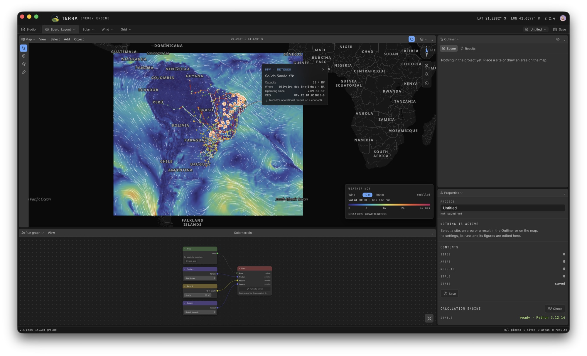
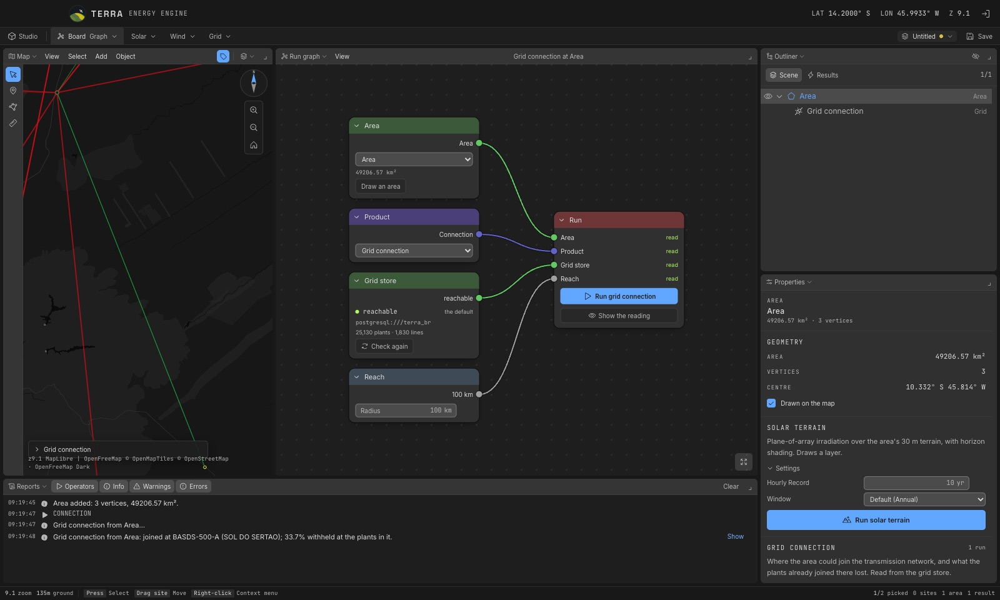
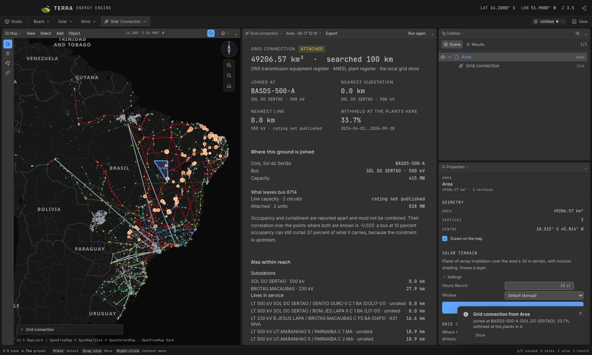
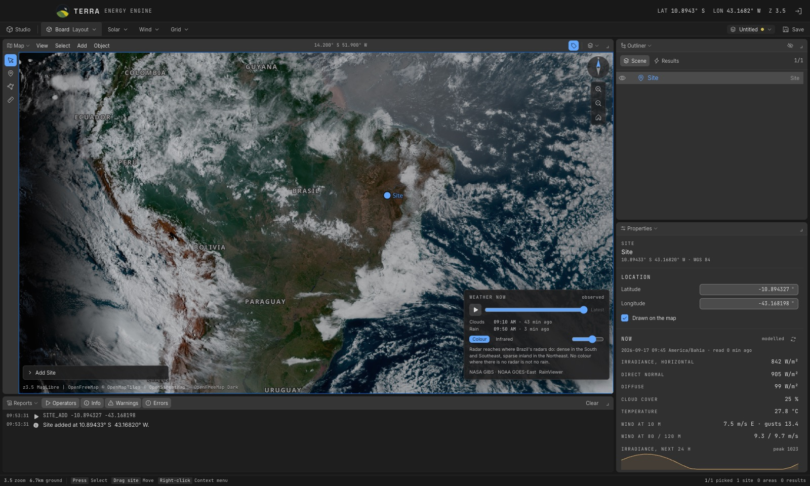
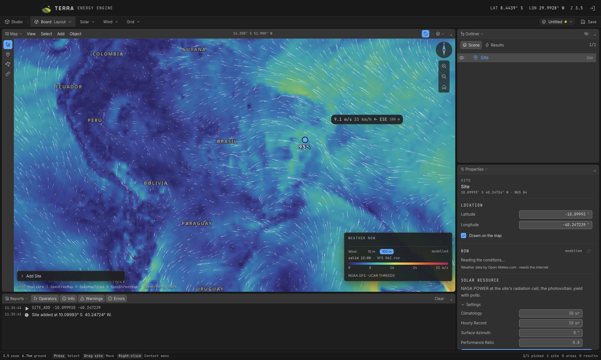

# TERRA Energy Engine

<p align="center">
  
</p>

<p align="center"><em>The wind now over South America, with the plant register and the transmission network from the grid store, a metered plant captioned where it was clicked, and the run graph of a solar terrain run below</em></p>

TERRA Energy Engine reads what a place is worth for solar and wind generation,
and what the electrical system would do to a plant there. At a site it reads
the solar resource and the photovoltaic yield, and screens the wind resource
at hub height. Over an area it maps the plane-of-array irradiation across the
terrain, with the shading of the horizon, and reads where the area could join
the transmission network. Over the whole map it shows the weather now: clouds,
rain and wind.

It runs locally as a desktop application. There is no server to sign in to:
the analyses run in a Python sidecar on the same machine, the Brazilian
electrical record is read from a PostGIS database on the same machine, and the
public data it needs is fetched on demand and cached.

The scope is deliberate. It is a screening tool for the study of particular
sites and areas, built on public data under stated assumptions. The figures
say what they were computed from and what they are not: the wind screening is
gross and unvalidated, a connection reading is not an access opinion, and a
modelled value is never drawn as a measured one.

It is a sibling of [TERRA](https://github.com/rexionmars/TERRA), the earth
observation application, and shares its studio, its look and, for the grid,
its database.

## The products

| product | read at | what it answers | from |
|---|---|---|---|
| **Solar resource** | a site | irradiation by month and year, and the photovoltaic yield | NASA POWER, pvlib |
| **Wind screening** | a site | the wind at hub height, how far it moves with the shear assumed, the operating regime | NASA POWER (MERRA-2) |
| **Solar terrain** | an area | plane-of-array irradiation over the terrain at 30 m, with horizon shading, by season | Copernicus DEM GLO-30, NASA POWER |
| **Grid connection** | an area | where plants of the area join the network, the headroom at that bus, what is within reach, and what the plants already joined there lost to curtailment | ONS and ANEEL registers, from the grid store |

Every result is kept in the project with the parameters and the place it was
computed at. Moving a site, redrawing an area or changing a setting afterwards
marks the result stale rather than relabelling it. Results of one product are
compared side by side in a table and exported as CSV or JSON; a terrain layer
also as a float32 GeoTIFF.

## The studio

The window is a studio after TERRA's, and TERRA's after Blender's: the screen
divides into areas, each holding one editor, and the arrangements are grouped
by subject.

| group | workspaces | built around |
|---|---|---|
| Board | Layout, Graph, Data, Scripting | the map, the run graph, the comparison table, the console |
| Solar | Resource, Terrain | the solar readings beside the map |
| Wind | Screening | the wind reading beside the map |
| Grid | Connection | the connection reading beside the map of plants and lines |

The editors are the **map**, the **outliner**, **properties**, the **run
graph**, a **reading** per product, the **data table**, the **reports** and a
**console**. Areas split, join, resize and maximise; the arrangement survives a
restart.

<p align="center">
  
</p>

<p align="center"><em>The run graph: a product's request as nodes wired into the run. Each input says whether the reading on screen read what its node holds now</em></p>

The **run graph** lays a product's request out as nodes, in the grammar of
Blender's node editor. The fields on a node are the project's settings, and
each input of the run node says whether the reading on screen read it:
*pending* after a setting changes, *reading* while a run is in progress,
*read* once it has, *error* when the last attempt failed.

Every action is an operator: reachable from a menu, a key, the operator search
(F3) and the console, with a poll that says why it cannot run instead of
failing after. Every change is an undo step. A project is one `name.terra`
file, with the terrain rasters in a `name.terra-data` folder beside it.

## The grid store

The Brazilian electrical record lives in a local PostgreSQL database with
PostGIS, `terra_br`, loaded by TERRA: the ANEEL plant register, the ONS
transmission register, and the ONS record of what each photovoltaic plant was
told not to generate. This application reads it and never writes to it.

<p align="center">
  
</p>

<p align="center"><em>A connection reading over the Sol do Sertão complex: joined at the 500 kV bus, what else is within reach, and a third of the energy withheld at the plants already there</em></p>

From it come two things. Four map overlays: plants in the operational record,
sized by capacity; plants that are registered only; transmission lines,
coloured by voltage as ANEEL colours them; and substation buses. Clicking one
captions it where it was clicked. And the **grid connection** product, which
leads with where plants of the area are joined, as the operator publishes it,
rather than with the nearest substation, which is often the wrong voltage of
the right station. Proximity and curtailment are reported apart and never
combined into a score.

Which database is read, in order: the `TERRA_BR_DSN` environment variable, the
one chosen in *Settings › Grid store*, then `postgresql:///terra_br` (the local
socket, your own role). TERRA reads the same variable and has the same default,
so both find one store without being told. A chosen connection is kept in a
file only you can read, and its password is never shown.

Without the store, everything else works; the grid overlays and the connection
reading say the store is unreachable, and why.

## The weather now

<p align="center">
  
</p>

<p align="center"><em>GOES-East clouds over South America, and the conditions now at a site</em></p>

Four readings of the weather, each saying whether it was **observed** or
**modelled**, and how old it is:

- **Clouds**, GOES-East through NASA GIBS, every ten minutes, in true colour or
  in infrared, published about forty minutes late.
- **Rain**, the radar composite from RainViewer, every ten minutes. Radar
  covers Brazil where Brazil's radars do: densely in the South and Southeast,
  sparsely inland in the Northeast, where no colour is no radar rather than no
  rain.
- **Wind**, the GFS model at 10 m or 100 m over South America, as a colour
  field with particles moving along it, the speed and direction under the
  pointer, and a label at each of the project's places.
- **Now**, at a site or an area, from Open-Meteo: irradiance, cloud, temperature
  and wind at 10, 80 and 120 m, the next 24 hours, and a comparison with the
  long-term readings the project already holds there.

The clouds and the rain play back over the last two hours. All four need the
internet; without it, each says so and the rest of the application is
unaffected.

<p align="center">
  
</p>

## Data and attribution

| data | source | terms |
|---|---|---|
| Irradiation, meteorology | [NASA POWER](https://power.larc.nasa.gov/) | public |
| Elevation | Copernicus DEM GLO-30, via the [Microsoft Planetary Computer](https://planetarycomputer.microsoft.com/) | free, with attribution |
| Plant register | [ANEEL](https://dadosabertos.aneel.gov.br/) (SIGA) | open data |
| Transmission, curtailment | [ONS](https://dados.ons.org.br/) | open data |
| Clouds | NOAA GOES-East, via [NASA GIBS](https://earthdata.nasa.gov/gibs) | public |
| Rain | [RainViewer](https://www.rainviewer.com/api.html) | free, with attribution; requests are rate-limited per address |
| Wind field | NOAA GFS, via [UCAR THREDDS](https://www.unidata.ucar.edu/software/tds/) | public; a research service with no availability promise |
| Conditions now | [Open-Meteo](https://open-meteo.com/) | CC BY 4.0; free for non-commercial use |
| Basemap | [OpenFreeMap](https://openfreemap.org/), © [OpenStreetMap](https://www.openstreetmap.org/copyright) contributors | ODbL |

Open-Meteo's free tier is for non-commercial use. Commercial use of the *Now*
section needs one of its subscriptions.

## Running it from source

**You need** Go 1.25 or newer, the [Wails CLI](https://wails.io/) v2.13,
Node.js 20.19 or newer (22.12 or newer on the 22 line), and Python 3.12. PostgreSQL with PostGIS and a loaded
`terra_br` are needed only for the grid products.

```sh
# The Python sidecar, in a .venv the application finds on its own
python3.12 -m venv .venv
.venv/bin/pip install -r requirements-dev.txt

# The interface
(cd frontend && npm install)

# Run with live reload, or build the application
wails dev
wails build
```

The sidecar's interpreter is `TERRA_ENERGY_PYTHON` when set, else the `.venv`
in the application directory, else `python3` on the `PATH`. The application
directory, the one holding `sidecar/main.py`, is `TERRA_ENERGY_APP_DIR` when
set, else found from the working directory or the executable.

**Tests**

```sh
go test ./...                                       # the shell; the grid tests use a local store when there is one
(cd sidecar && ../.venv/bin/python -m pytest -q)    # the sidecar
(cd frontend && npx tsc --noEmit)                   # the interface's types
```

## Where it keeps things

| what | where |
|---|---|
| local accounts, the chosen grid store | the user configuration directory, `terra-energy-engine/` |
| NASA POWER series, the hour's wind field | the user cache directory, `terra-energy-engine/power` and `/wind` |
| terrain rasters of the session | a temporary directory, removed on quit; saved with the project |
| the studio's arrangement, overlays, recent files | the webview's local storage |

## Layout

| path | what |
|---|---|
| `main.go`, `app*.go` | the Wails shell and the bindings the interface calls |
| `internal/sidecar` | starts the Python sidecar, one request at a time, cancellable |
| `internal/energy`, `internal/grid`, `internal/weather` | what each product sends and the shape of what comes back |
| `internal/store` | the local account database |
| `sidecar/terra_energy_engine` | the computation: `energy`, `sun`, `terrain`, `imagery`, `grid`, `weather` |
| `frontend/src` | the studio: `lib` holds the state and the map, `components` the editors |

The sidecar speaks the protocol TERRA's does: one JSON request on stdin,
progress on stderr, one JSON result on stdout. Its actions carry TERRA's names
and result shapes where the two applications share a product, so an action can
move between them unchanged.
